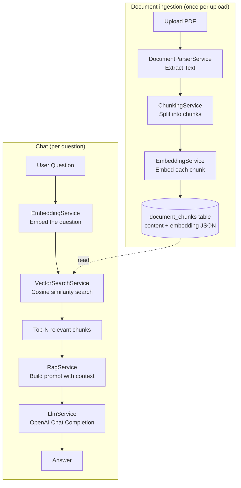

# Document RAG Chatbot

A basic, learning-focused implementation of a **RAG (Retrieval-Augmented
Generation)** chatbot: upload a PDF, ask questions about it, and get answers
grounded only in that document's content.

Built with Laravel 11, Vue 3, and Inertia.js.

## What this project does

1. You upload a PDF.
2. The app extracts its text, splits it into small chunks, and turns each
   chunk into an embedding (a numerical representation of its meaning),
   storing everything in MySQL.
3. You ask a question in the chat UI.
4. The app embeds your question, finds the most similar chunks, and sends
   them to an LLM (OpenAI) along with your question.
5. The LLM answers **using only the document's content**. If the answer
   isn't in the document, it says so instead of guessing.

## What is RAG?

A plain LLM only knows what it was trained on — it has never seen your PDF.
RAG (Retrieval-Augmented Generation) works around that by fetching relevant
pieces of *your* document at question time and handing them to the LLM as
context, so it can answer as if it had read the document.

| Term | Meaning |
|---|---|
| **Chunk** | A small piece of the original document's text (e.g. a few paragraphs). Documents are split into chunks because LLMs and embedding models work on limited amounts of text at once. |
| **Embedding** | A list of floating point numbers that represents the *meaning* of a piece of text. Two pieces of text with similar meaning get embeddings that are numerically close together. |
| **Vector search** | Comparing the question's embedding against every chunk's embedding to find the ones with the closest/most similar meaning. |
| **Retrieval** | The act of finding and fetching those relevant chunks. |
| **Augmentation** | Inserting the retrieved chunks into the prompt sent to the LLM, as "context". |
| **Generation** | The LLM reading the question + context and producing the final answer. |

## Architecture



### Data flow, step by step

**Ingestion** (`ProcessDocumentJob`, run in the background after upload):

```
PDF -> Extract Text -> Chunk -> Embed each chunk -> Store chunks -> status: completed
```

**Chat** (`RagService::ask()`, run per question):

```
Question -> Embedding -> Vector Search -> Relevant Chunks
         -> Prompt + Context -> LLM -> Answer
```

### Laravel structure

```
Controller -> FormRequest -> Service -> Model / External API
```

- `app/Http/Controllers/DocumentController.php` — upload & list documents.
- `app/Http/Controllers/ChatController.php` — show chat, handle questions.
- `app/Http/Requests/UploadDocumentRequest.php`, `ChatRequest.php` — validation.
- `app/Services/DocumentParserService.php` — PDF -> plain text.
- `app/Services/ChunkingService.php` — plain text -> chunks.
- `app/Services/EmbeddingService.php` — text -> embedding vector (OpenAI).
- `app/Services/VectorSearchService.php` — embedding -> top-N similar chunks.
- `app/Services/LlmService.php` — prompt -> generated answer (OpenAI).
- `app/Services/RagService.php` — orchestrates the full chat flow above.
- `app/Jobs/ProcessDocumentJob.php` — runs the ingestion flow in the background.
- `app/Models/{Document,DocumentChunk,Conversation,Message}.php`.

### Database

| Table | Purpose |
|---|---|
| `documents` | One row per uploaded PDF: name, storage path, status (`pending`/`processing`/`completed`/`failed`). |
| `document_chunks` | One row per chunk: `document_id`, `chunk_index`, `content`, `embedding` (JSON array of floats). |
| `conversations` | One conversation per document. |
| `messages` | `role` (`user`/`assistant`) + `content`, belongs to a conversation. |

### Vector search implementation

Embeddings are stored as a JSON column in MySQL — no separate vector
database. At query time, `VectorSearchService` pulls a document's chunk
embeddings and computes [cosine similarity](https://en.wikipedia.org/wiki/Cosine_similarity)
against the question's embedding in PHP, then returns the top 5. This is a
brute-force approach (it compares against every chunk), which is simple to
run locally and fast enough for a handful of documents. If this needed to
scale to a huge number of chunks, only `VectorSearchService` would need to
change — e.g. to use pgvector or a hosted vector database — since the rest
of the app only depends on its public `search()` method.

## Technologies used

- **Laravel 11** (PHP 8.2) — backend framework.
- **Vue 3** (Composition API, `<script setup>`) + **Inertia.js** — frontend, no separate API/SPA needed.
- **MySQL** — stores documents, chunks (+ embeddings as JSON), conversations, messages.
- **Laravel Queue** (`database` driver) — processes uploaded PDFs in the background.
- **OpenAI API** — `text-embedding-3-small` for embeddings, `gpt-4o-mini` for chat generation.
- **smalot/pdfparser** — PDF text extraction.
- **Tailwind CSS** — minimal styling.

## Installation

```bash
composer install
npm install

cp .env.example .env
php artisan key:generate
```

## Environment variables

Edit `.env`:

```env
DB_CONNECTION=mysql
DB_HOST=127.0.0.1
DB_PORT=3306
DB_DATABASE=document_rag_chatbot
DB_USERNAME=root
DB_PASSWORD=

OPENAI_API_KEY=sk-...
OPENAI_EMBEDDING_MODEL=text-embedding-3-small
OPENAI_CHAT_MODEL=gpt-4o-mini
```

Get an OpenAI API key at <https://platform.openai.com/api-keys>. It is read
only from the environment (`config/services.php`) — never hardcoded or sent
to the frontend.

## Database setup

Create the database, then run migrations:

```bash
mysql -u root -e "CREATE DATABASE document_rag_chatbot"
php artisan migrate
```

## Vector storage setup

Nothing extra to install — embeddings live in the `document_chunks.embedding`
JSON column of your existing MySQL database (see "Vector search
implementation" above).

## Running the application

You need three things running:

```bash
php artisan serve       # backend + Inertia pages
npm run dev              # Vite dev server (Vue/JS)
php artisan queue:work   # processes uploaded PDFs in the background
```

Then open the app (default `http://127.0.0.1:8000`).

> If you don't want to run a queue worker, set `QUEUE_CONNECTION=sync` in
> `.env` — documents will then be processed synchronously during the upload
> request instead of in the background. This is fine for small PDFs and
> simplest to run locally; switch back to `database` (plus `queue:work`,
> or Redis via `QUEUE_CONNECTION=redis`) once processing time becomes
> noticeable.

## How document processing works

1. `DocumentController::store()` validates the upload (PDF only, ≤10MB),
   stores the file under `storage/app/private/documents` with a generated
   filename (the original filename is never trusted), creates a `documents`
   row with `status: pending`, and dispatches `ProcessDocumentJob`.
2. The job sets `status: processing`, then runs:
   - `DocumentParserService::extractText()` — pulls plain text out of the PDF.
   - `ChunkingService::chunk()` — splits it into ~1000-character overlapping chunks.
   - `EmbeddingService::embedBatch()` — embeds all chunks in one OpenAI API call.
   - Saves each chunk + its embedding to `document_chunks`.
3. On success, `status` becomes `completed`; on any failure, `status`
   becomes `failed` with a user-friendly `error_message` (the technical
   error is logged, not shown to the user).
4. The Documents page polls the server every few seconds while anything is
   pending/processing, so the status updates automatically.

## How chat works

1. `ChatController::show()` renders the chat page for a document, loading
   its (single) conversation and messages so far.
2. `ChatController::store()` validates the question, refuses it if the
   document isn't `completed` yet, saves the question as a `user` message,
   and calls `RagService::ask()`.
3. `RagService::ask()` runs the RAG pipeline: embed the question, run
   vector search against that document's chunks, build a prompt that
   instructs the LLM to answer only from the retrieved context, and calls
   `LlmService::generate()`.
4. The answer is saved as an `assistant` message and the page reloads with
   the updated conversation.

## Example question/answer

Given a PDF containing:

> Employees are allowed 12 casual leaves per year.

Asking **"How many casual leaves are allowed?"** returns:

> According to the document, employees are allowed 12 casual leaves per year.

Asking something the PDF never mentions, e.g. **"What is the CEO's salary?"**,
returns something like:

> The information was not found in the uploaded document.

## Limitations

- Brute-force vector search in PHP — fine for a handful of documents, not
  built for scale (see "Vector search implementation").
- One conversation per document, no multi-document chat.
- Simple fixed-size chunking (no sentence/paragraph awareness).
- No authentication — anyone with access to the app can see all documents.
- No PDF OCR — scanned/image-only PDFs with no text layer won't extract
  any content.
- No streaming responses; the answer appears once fully generated.

## Possible future improvements

- Swap `VectorSearchService`'s implementation for a real vector database
  (pgvector, Pinecone, etc.) if the number of chunks grows large.
- Smarter chunking (by sentence/paragraph, or token-aware).
- Multi-document chat / cross-document search.
- Streaming answers token-by-token.
- User accounts so each user only sees their own documents.
